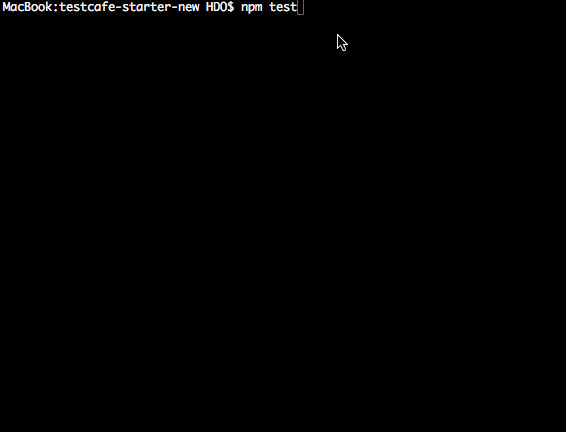
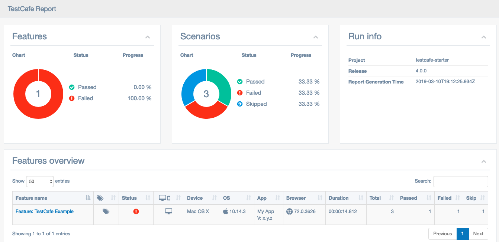
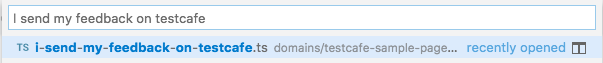
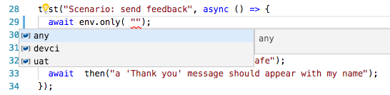

# TestCafe Starter

<a href="https://github.com/DevExpress/testcafe">
    
</a>

## A lightweight and extensible framework to write e2e tests in a gherkin-like syntax.

```typescript
fixture('Feature: TestCafe Example')
  .before(async (ctx) => {
    // inject global configuration in the fixture context
    ctx.config = getCurrentConfig();
  })
  .beforeEach(async (t) => {
    // inject page model in the test context
    t.ctx.inputData = pageModel;
    await given('I navigate to the testcafe sample page');
  });

test('Scenario: cannot submit my feedback when I did not enter my name', async () => {
  await then('no name should be populated');
  await and('I cannot submit my feedback on testcafe');
});

test('Scenario: can send feedback with my name only', async () => {
  await when('I enter my name');
  await then('I can submit my feedback on testcafe');
});

test('Scenario: send feedback', async () => {
  await given('I enter my name');
  await when('I send my feedback on testcafe');
  await then("a 'Thank you' message should appear with my name");
});
```



## Benefit from TypeScript Strong Typing and Visual Studio Code IntelliSense to write tests that are aligned with the business


## After cloning the repo

- run the command `npm install`.

## To execute the tests locally

- run the command `npm test`.

## To execute the tests locally with an HTML report of tests execution

- run the commands:

  ```sh
  npm run test:json
  npm run report
  ```

This will generate a nice and searchable HTML report like this ([more details here](https://github.com/hdorgeval/testcafe-reporter-cucumber-json)):



## To execute the tests on TeamCity

- run the command `npm run test:teamcity`.

## To configure the target environment and the target persona

- add the following options to the TestCafe command-line `--env=xxx --user=yyy`
- you can create any type of option on the command-line: see the [readme](config/README.md) in the [config](config) folder.

## To create custom command-line options on top of TestCafe command-line options

- You can add any custom command-line options to the existing TestCafe command-line options.
- To do this, customize the content of [parsed-config.ts](config/parsed-config.ts).

## To check for typescript and linting errors

- run the command `npm run build`.

## To debug a test in Visual Studio Code

- set one or more breakpoints in your code
- setup the TestCafe configuration used by the debug session in the [default-config.ts](config/default-config.ts) file
- in the Debug menu, select the `TestCafe` option
- if you want to start TestCafe with specific command-line options you can modify the [launch.json](.vscode/launch.json) file
- Start debugging

## To use Live mode

Live mode provides a service that keeps the TestCafe process and browsers opened the whole time you are working on tests. Changes you make in code immediately restart the tests. That is, TestCafe Live allows you to see test results instantly.

- rename the feature file into a name that ends with .live.ts
- add .only to the test(s) on which you want to work live
- run the command `npm run test:live`

## Visual Studio Code requirements

- the VS Code version must be >= 1.18.0

## Recommended Visual Studio Code Extensions

- Move TS (will automatically chage all imports when you rename or move a step file)
- TSLint
- Git Lens
- Regex Previewer by Christof Marti
- TestCafe Snippets (see [say goodbye to flakyness](https://github.com/hdorgeval/testcafe-snippets))
- TestCafe Test Runner (see [How to execute a test from Visual Studio Code IDE](#how-to-execute-a-test-from-visual-studio-code-ide))

## How to jump into the implementation of a step (Visual Studio Code)

- Go to the Command Palette with ⌘P (Ctrl+P on Windows)

- Start typing the sentence. For example `I send my feedback on testcafe`

- select the found step file:

  

## How to create a new feature file

- see the [readme](features/README.md)

## How to create a new step-definition file

- see the [readme](steps/README.md)

## How to run a test only in specific environment(s)

- The environment is the host that will execute the TestCafe tests.
- The environment is set in the config object injected at runtime in the Fixture Context.
- All possible values are, by convention, defined in the [environments.ts](config/environments.ts) file

- Add this line as a first step in the test:

```typescript
test('Scenario: send feedback', async () => {
  await env.only('devci');
  //
  await given('I enter my name');
  await when('I send my feedback on testcafe');
  await then("a 'Thank you' message should appear with my name");
});
```


- to select another environment, just use the VS Code IntelliSense:
  

- to target multiple environments:

```typescript
test('Scenario: send feedback', async () => {
  await env.only('uat', 'devci');
  //
  await given('I enter my name');
  await when('I send my feedback on testcafe');
  await then("a 'Thank you' message should appear with my name");
});
```

## How to execute a test from Visual Studio Code IDE

To start a test from the IDE you need to install the Visual Studio Code extension [TestCafe Test Runner](https://github.com/romanresh/vscode-testcafe).

### To run a specific test

Right-click on the test and and select TestCafe: `Run Test(s) in...` for the required browser.

### To run all tests in a feature file

Right-click on the feature file within the Explorer panel and select TestCafe: `Run Test(s) in...` for the required browser.
