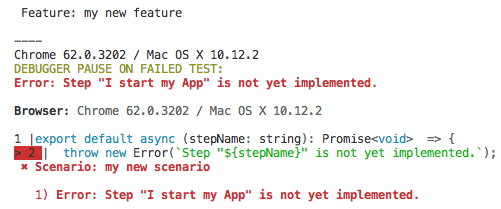

# TestCafe Sample Page Domain

This folder is, by convention, the place for all step definition files related to the TestCafe Sample Page.

By convention, step definition files are organized in the following way:

* the `models` folder contains the definition for all the page/view/data models you want to use at runtime;
* the `selectors` folder contains the definitions for all TestCafe Selectors you will need at runtime;
* the `steps` folder contains the implementation of each steps;
* the `given-when-then-mappings.ts` file contains the mapping between step names and implementation;
* the `index.ts` file gathers all items exposed by the domain:
  * step names; 
  * mappings;
  * object models.

  ## Creating a new step

  * Open the `given-when-then-mappings.ts` file in the VS Code editor.
    * If you need to create a new `given` or `when` step, add a new entry in the `givenStepMappings` literal object
    * For a `then` step, add a new entry in the `thenStepMappings` literal object
    * map each new step to the "not implemented" step:
    ```typescript
    export const givenStepMappings = {
      // code omitted for brevity
      "I input the given data": step.not_implemented_step,
      "I send my form": step.not_implemented_step,
      "I start my App": step.not_implemented_step,
    };

    export const thenStepMappings = {
      // code omitted for brevity
      "I should receive a specific response": step.not_implemented_step,
    };
    ```
    * check, in the feature file, that all created steps are now recognized by Visual Studio Code IntelliSense
    * set the `test` to `test.only` and run the test. 
    * check the test fails with the following message:
      

    * it's time now to write the real step implementation:
      * create a new empty file in the `steps` folders.
      * give this file the same name as the step name 
      * consider using the kebab-case naming convention in order to quickly find the implementation associated to a given step through the Command Palette:
        

    


