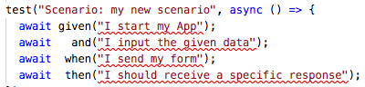
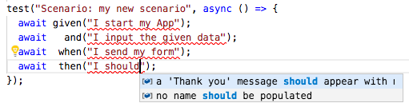

# Features

This folder is, by convention, the place for the TestCafe test files.

## Creating a new test

* Create an empty TypeScript file and give it a name like `my-new-feature.spec.ts`

* Paste the following code in this new file:

```typescript
import "testcafe";
import config from "../config/testcafe-config";
import {defaultPageModel as inputData} from "../domains/testcafe-sample-page";
import {and, given, then, when} from "../step-runner";

fixture(`Feature: my new feature`)
  .before(async (ctx) => {
    // global config is injected in the fixture context
    ctx.config = config;
  })
  .beforeEach(async (t) => {
    // inject your page model in the test context
    t.ctx.inputData = inputData;
  });

test("Scenario: my new scenario", async () => {
  await given("I start my App");
  await   and("I input the given data");
  await  when("I send my form");
  await  then("I should receive a specific response");
});

```

This starter project has been designed to put the business at the center of the e2e strategy.

The way you express the different steps should be aligned with the language used by the business and/or end-users.
Take time to make your steps readable by those people.

Visual Studio Code IntelliSense signals you these new steps are unknown:



To see if an existing step can be used, just empty the step name and use VS Code IntelliSense:



If you don't find an existing suitable step, you need to create a new one [here](../domains/README.md).
