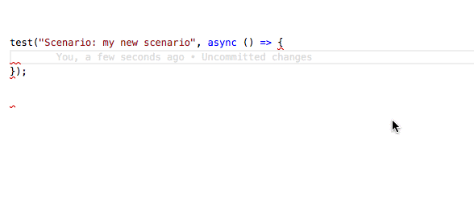

# Step Mappings

This folder is, by convention, the place for step-mappings files.

step-mappings is the glue between the step-definition files and the feature files.

step-mappings also provide strong type-checking and Visual Studio Code IntelliSense when writing steps in feature files.



The steps mappings files are [steps.ts](steps.ts) and [index.ts](index.ts).

These two files are auto-generated by a script located in the [generator](generator) folder.

The generation process is driven by the configuration file [config.ts](config.ts)

step-mappings files can be regenerated at any time by running the command:

```sh
npm run build-step-mappings
```

> **You MUST run this command each time you add/modify/move/delete a step-definition file.**
