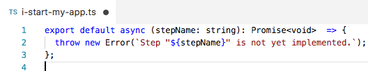

# Code snippets for creating steps in testcafe-starter

## Installing the code snippets
* run the command `npm run install:snippets`
* restart Visual Studio Code

## stc-not-implemented-step

* create an empty typescript file for a step implementation
* start typing the prefix stc:
  
* this will result in:
  