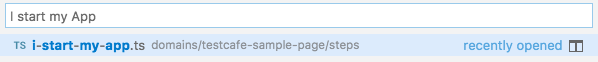
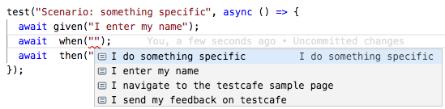

# TestCafe Step-definition files

This folder is, by convention, the place for all step definitions.

## Creating a new step

Let's say you want to create a step-definition file for the sentence `When I do something specific`.

- Create a new empty file in the `steps` folder and name it `i-do-something-specific.ts`.

- Consider using the kebab-case naming convention in order to quickly find the implementation associated to the step through the Command Palette:

  

- Copy, in this new file, the content of the [basic template step definition file](../step-templates/basic-template-step.ts) or the content of the [not implemented step definition file](../step-templates/not-implemented-step.ts);

- Adapt the jsDoc comments:

```js
/**
 * @step
 * @when("I do something specific")
 */
```

- If the statement should be available as a `Given` **and** a `When` step, the JSDoc comments should be:

```js
/**
 * @step
 * @given,@when("I do something specific")
 */
```

- If the same step-definition must be re-used for different statements, the JSDoc comments should be (see [this step implementation](a-xxx-message-should-appear-with-my-name.ts) for more details):

```js
/**
 * @step
 * @given,@when("I do something specific")
 * @when("I set the user name as 'john doe'")
 * @when("I set the user name as 'Perry Scope'")
 * @when("I set the user name as 'Art Decco'")
 */
```

- for a `Then` step:

```js
/**
 * @step
 * @then("I do something specific")
 */
```

- for a `But` step:

```js
/**
 * @step
 * @but("I do something specific")
 */
```

- Save the new step-definition file and run the following command in a terminal window:

```sh
npm run build-step-mappings
```

- Now go back to the feature file. The sentence should be available in the intellisense:



## Modifying/moving/deleting a new step

> **You MUST run this command each time you add/modify/move/delete a step-definition file.**:

```sh
npm run build-step-mappings
```
